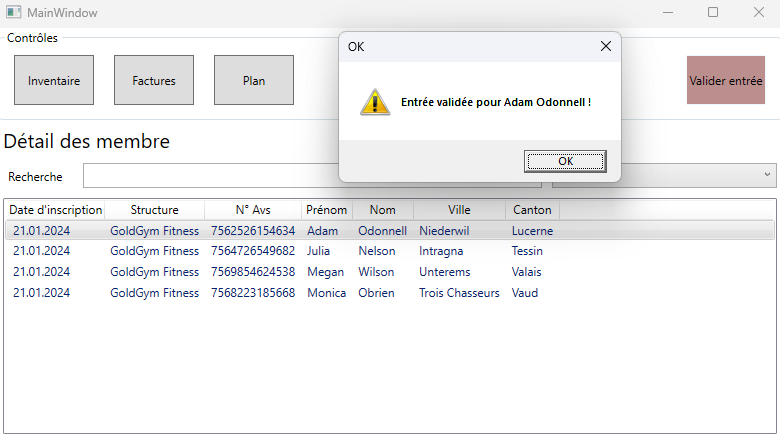
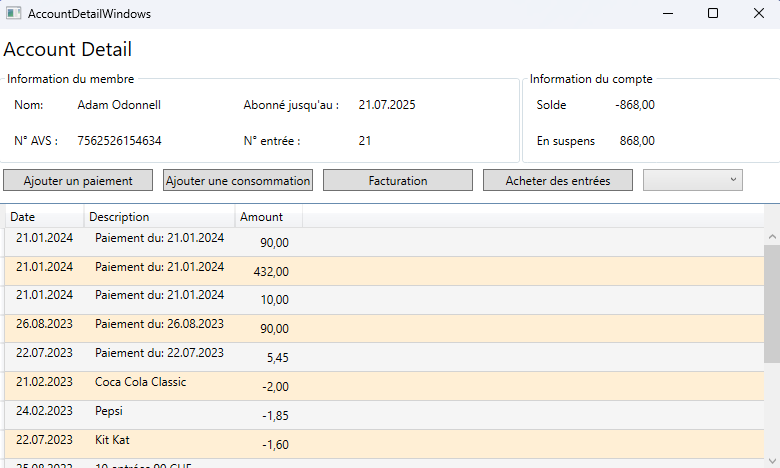
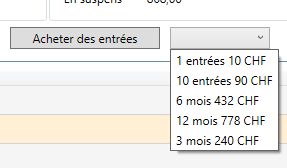
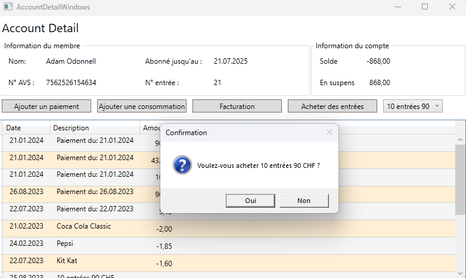
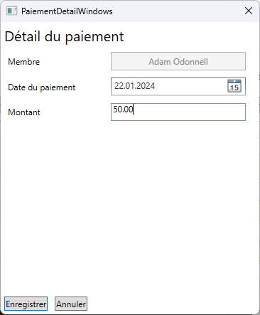
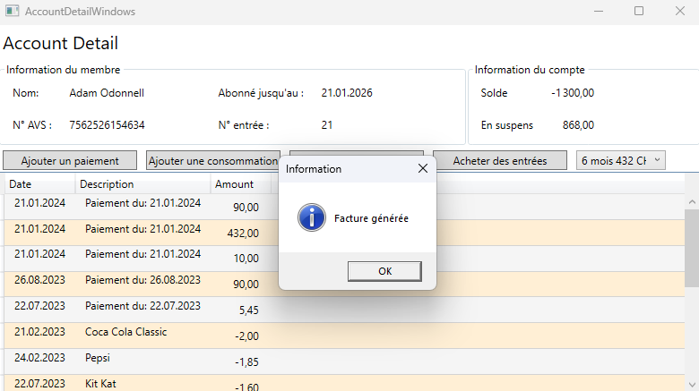
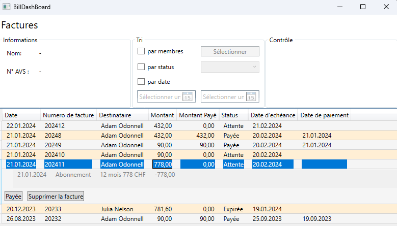

# Membership Manager Presentation
---

## D'où vient l'idée ?
L'idée découle d'un réel problème rencontré par un proche des membres du groupe, qui par la reprise d'une salle de sport s'est retrouvé avec une charge administrative élevée. 

---

## Quels étaient les problèmes à résoudre ?
- Le problème est que la gestion des membres est une tâche répétitive et chronophage.
- La gestion des entrées et abonnements prend du temps à chaque entrée de membre.
- Le contrôle de la facturation sans aide informatique est une tâche difficile et source d'erreur.

---
# Objectifs de l'application ?
---

## Validation des entrées
Lors de l'arrivée d'un membre, l'application permet de saisir rapidement le nom de membre et de valider son entrée.


---

## Gestion du compte du membre
Une interface permet de gérer le compte du membre, de voir ses entrées, ses abonnements et de générer des factures.


---

## Gestion des abonnements et entrées
L'application permet d'ajouter un plan d'abonnement ou d'entrée au membre.



---

## Gestion des paiements

L'application permet de saisir des paiements ou de générer des factures.
 

---

## Gestion des factures

Cette partie permet de suivre les factures générées selon leurs êtats et de la marquer comme payées si tel est le cas.
Les factures peuvent être triées par date, par membre ou par état.




---

# Implémentation
---

## Structure du projet - Base


---

## Structure du projet - implémenté


---

## Technologies utilisées
- C#  
- WPF - XAML


---

## Interactions avec la base de données - Requête simple

```csharp
public interface ISql
    {

        public void Insert();

        public void Update();

        public abstract static void Delete(params object[] pk);

        public abstract static ISql? Select(params object[] pk);

        public bool Validate();
    }
```

---

## Interactions avec la base de données - Requête personnalisée

`bill.cs`
```csharp
 public new static List<SqlViewable>? Views(params NpgsqlParameter[] sqlParam)
 {
    ...

     NpgsqlCommand cmd = new();

     StringBuilder SqlQuery = new(@"SELECT bill.id, bill.issue_date, bill.payed_date, 
                                        bill.payed_amount,paiement.payed, paiement.account_id,
                                        amount, date, person.first_name, person.last_name
                                    FROM Bill
                                        LEFT JOIN paiement ON bill.id = paiement.id
                                        LEFT JOIN memberaccount ON paiement.account_id = memberaccount.id
                                        LEFT JOIN person ON memberaccount.id = person.no_avs");
     if (sqlParam.Length == 2)
     {
         SqlQuery.Append(" WHERE paiement.account_id = @id AND Payed = @payed");
         cmd.Parameters.AddRange(sqlParam);
     }
     else if (sqlParam.Length == 1 && sqlParam[0].ParameterName.Equals("@id"))
     {
         SqlQuery.Append(" WHERE paiement.account_id = @id");
         cmd.Parameters.Add(sqlParam[0]);
     }
     else if (sqlParam.Length == 1 && sqlParam[0].ParameterName.Equals("@payed"))
     {
         SqlQuery.Append(" WHERE Payed = @payed");
         cmd.Parameters.Add(sqlParam[0]);
     }
    ...
 }
```

