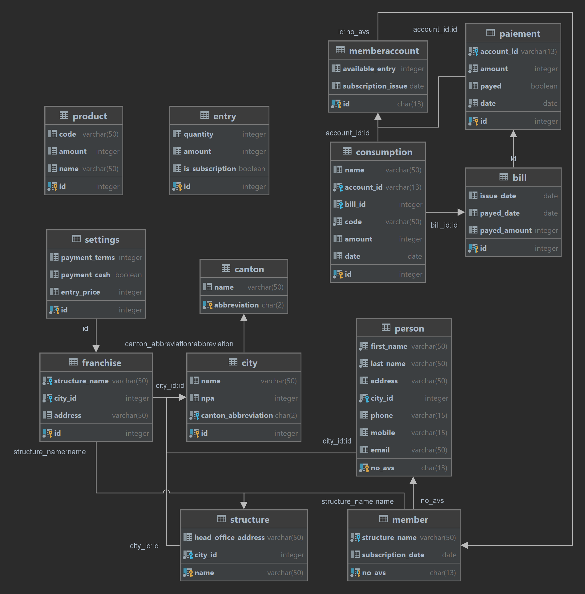

## 
Rapport de projet

 
 

# 
 Membership Manager

<i>Version 1.0.0.0 - BETA</i>

 

## 
Département : TIC

## 
Unité d'enseignement BDR

             

Auteur:     **Alexandre Iorio, Colin Jaques et Walid Slimani**

Professeur: **Nastaran Fatemi**

Assistant : **Christopher Meier**

Salle de labo : **J01**

Date : **21.01.2024**

## 1. Introduction

### 1.1 Contexte

Dans le cadre de ce cours, il nous a été demandé de développer une application permettant de mettre en pratique ce que nous avons vu en cours de `Base de données relationnelles`

Nous avons réalisé une application desktop permettant la visualisation et la manipulation d'une base de données.

## 2. Phase I : Cahier des charges

Dans un premier temps, nous avons établi un cahier des charges contenant la description détaillée de l’analyse des besoins. Cette analyse nous à permis de comprendre à la fois les besoins en données et les besoins fonctionnels.

Le cahier des charges mis à jour est disponible sur Github:

https://github.com/AlexandreIorio/MembershipManager/blob/main/RequirementSpecification/ProjectRequirementSpecification.md

## 2. Phase II : Modélisation conceptuelle

Une fois le cahier des charges validé, nous avons établi le schéma conceptuel de base auquel nous avons retiré un parti (en rouge sur le schéma) afin de réaliser un travail d'ampleur raisonnable.

Lors de l'implémentation, nous nous sommes concentrés sur la problématique de base mentionnée dans le cahier des charges, à savoir

The previous owner managed the affairs of the fitness establishment without any computer assistance; subscriber management was done using paper documents, most of which are either not retrievable or have been lost. To this day, individuals, who purchased a subscription, show up at the establishment, and the current manager struggles to determine when and how members took out their subscriptions. Furthermore, billing and payment reminders are handled manually using paper cards with hand-written dates to track the invoices due dates. Invoices are manually created in a word processing software without using any mailing process. Currently, there are just over 400 members to manage with limited computer support.

 
Lors du développement de la phase 5, nous nous sommes aperçus que certains éléments devaient être modifiés afin de pouvoir mettre les données en relation. 

Voici le schéma conceptuel du ce qui a été réalisé

## 3. Phase III et IV : Modélisation conceptuelle et création des scripts de création de la base de données

Dès lors, nous avons pu implémenter le schéma conceptuel en base de données relationnelle. Nous avons utilisé le SGBD `PostgreSQL` et avons créé un script de création de la base de données. Dans un premier temps, le script comprenait la totalité des relations mentionnées dans le schéma conceptuel, cependant, nous avons dû retirer certaines relations afin de pouvoir implémenter la base de données et garantir le bon fonctionnement de l'application dans le délai imparti.

Le script de création de la base de données est disponible sur Github: https://github.com/AlexandreIorio/MembershipManager/blob/main/RelationalModeling/database.sql

Les relations ci-dessus peuvent être peuplées à l'aide des scripts de peuplement de la base de données afin de pouvoir tester l'application. 

Ces scripts sont disponibles sur Github:  https://github.com/AlexandreIorio/MembershipManager/tree/main/RelationalModeling/populate

L'ordre d'exécution des scripts de peuplement est le suivant et doit être respecté afin de garantir l'intégrité des données: 

- database.sql
- canton.sql
- city.sql 
- structure.sql 
- franchise.sql 
- product.sql 
- entry.sql 
- person.sql 
- member.sql 
- paiement.sql 
- bill.sql 
- consumption.sql

## 4. Phase V : Implémentation de l'application

Nous avons choisi d'utiliser le langage `C#` et le framework `WPF` afin de réaliser l'application. Nous avons utilisé le pattern `MVVM` afin de séparer la logique métier de l'interface graphique.

Pour les requêtes SQL simples, nous avons implémenté des méthodes utilisant la réflexion afin de pouvoir générer les requêtes SQL à partir des objets métiers. Pour les requêtes plus complexes, nous les avons créés à la main directement dans les objets.

Notre application permet de visualiser les données de la base de données et de les manipuler en gérant des membres ainsi que leurs consommations et leurs factures.

